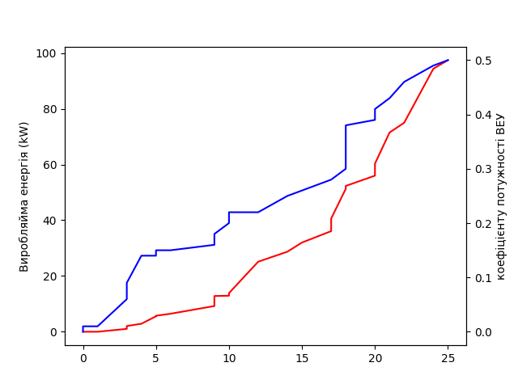

# Python_Engineering
---

## monads

Завдання:


Виконано на мові Python, Вибрані монади:

1. Maybe
2. Supervisor/Actor
3. Sequence

Результат виконання монад:

```

Maybe: 

100
True
10.0
c:\Users\ykuch\OneDrive\Рабочий стол\MyProjects\GIT\Python_Engineering\monads\monads\main.py:21: RuntimeWarning: divide by zero encountered in double_scalars
  m3 = m2.bind(lambda x: x / 0)
True
inf
False

Supervisior/actor: 

add: id: 1 [Hello]
id: 1 [Hello]
Remove: id: 1 [Hello]
add: id: 2 [World]
break............ id: 2 [World]        
reexecute: 2
break............ id: 2 [id: 2 [World]]
reexecute: 2
id: 2 [id: 2 [World]]
Remove: id: 2 [World]
add: id: 3 [Actor]   
break............ id: 3 [Actor]
reexecute: 3
id: 3 [id: 3 [Actor]]
Remove: id: 3 [Actor]
add: id: 4
id: 4 
Remove: id: 4 
add: id: 5 [Python]
id: 5 [Python]
Remove: id: 5 [Python]
 Hello World Actor in Python
I just sent a hi....

Sequence: 

xs = [2; 1; 11], ys = 110
xs = [10; 123; 5], ys = 1230
xs = [81; 2; 13], ys = 940
xs = [15; 34; 122], ys = 1710
xs = [0; 0; 0], ys = 0
```

---
## qadro

Завдання із керуванням дрону за допомогою Python та оформленням звіту

---
## tasks

Завдання зі інженерії на Python, робота із базами данних, кресленням, веб дизайном.

### Завдання 2:

Дано бази данних із погодами різних міст України з різними місяцями у вигляді Excel файлів, потрібно скласти графіки із данних

Вивід програмии:
```
Виберіть регіон із списку:
1 - Дніпропетровськ     
2 - Донецьк
3 - Івано Франківськ    
4 - Харків
5 - Кривий Ріг
6 - Київ
7 - Луганськ
8 - Львів
9 - Одеса
10 - Сімферополь        
Введіть індекс регіону: 6
вибрано Київ
Виберіть номер місяця за яким надати інформацію: 
Введіть календарний номер місяця: 11
Теблиця залежності температур
+-------------+------+----+------+------+------+----+----+----+----+------+------+------+----+----+----+----+------+----+------+------+----+------+------+------+
| Температура | -1   | -2 |  0   |  1   |  2   |  3 |  4 |  5 |  6 |  7   |  8   |  9   | 10 | 11 | 12 | 13 | 14   | 15 | -3   | -4   | -5 | -6   | -7   | -8   |
+-------------+------+----+------+------+------+----+----+----+----+------+------+------+----+----+----+----+------+----+------+------+----+------+------+------+
| Значення    | 43.5 | 23 | 54.5 | 30.5 | 41.5 | 75 | 89 | 64 | 80 | 41.5 | 46.5 | 36.5 | 22 | 11 |  8 |  8 |  9.5 |  1 |  8.5 |  7.5 |  9 |  5.5 |  2.5 |  1.5 |
+-------------+------+----+------+------+------+----+----+----+----+------+------+------+----+----+----+----+------+----+------+------+----+------+------+------+
Теблиця залежності вітрів
+-----------------------+-----+------+-------+-----+------+----+------+------+---+------+----+------+
| Швидкість вітру (м/с) |   2 |  1   |   3   |   4 |  5   |  6 |  7   |  8   | 9 | 10   | 11 |  0   |
+-----------------------+-----+------+-------+-----+------+----+------+------+---+------+----+------+
| Тривалість (год)      | 134 | 48.5 | 186.5 | 153 | 80.5 | 41 | 36.5 | 12.5 | 6 |  2.5 |  1 | 17.5 |
+-----------------------+-----+------+-------+-----+------+----+------+------+---+------+----+------+
```

Графіки:

1. Графік температури


2. Діаграмма тривалості температурних режимів


3. Діаграмма напрямку та сили вітру


4. Діаграмма вітрового потенціалу за швидкостями


Усі бази данних розташовані по папкам, графіки зберігаються у фарматі PDF

### Завдання 3

Теплотехнічні характеристики будівлі, потреба у тепловій енергії на
опалення, ГВП та вентилювання

Будинок:


результат виконання програмии:
```
питомі тепловтрати будівлі: 0.47 Вт/м²
Загальна площа приміщення: 30000000 м²
Обсяги споживання води на прийоми душу: 30 л
Задаємо температуру води при прийомі душу
Обсяги споживання води на прийоми ванни: 0 л
Задаємо температуру води при прийомі ванни
Корегування витрати гарячої води для визначеної температури на виході з бака ГВП:
Для душу: 4.12 л/добу  
Для ванни: 4.12 л/добу 
Загальні: 4.12 м³/добу.
Енергія необхідна для нагріву води: 23.96 кВт·год
Необхідна теплова потужність нагрівача: 2.4 кВт
потужність тепловтрат будівлі: 183.3 кВт
витрати енергії на опалення за визначений період: 2566.2 кВт
```

Графічний іньерфейс:


### Завдання 4

Моделювання графіка електричного навантаження


## Завдання 5

Визначення ефективності впровадження вітроенергетичної установки для
потреб енергозабезпечення об’єкта

Графіки:




результат виконання программи:
```
Синія лінія на графіку - відношення швидості і виробленої енергії (ось У ліворуч) 
Червона лінія на графіку - відношення швидості і поткужності ВЕУ (ось У праворуч) 
Обяги згенерованої енергії за визначений проміжок часу: 22790.65 кВт;
Oцінкa обсягів скорочень викидів парникових газів у тонах СО2 еквіваленту: 24.58 т;
Дохід від продажу електричної енергії за «зеленим» тарифом: 1595345.50 грн;   
Дохід від продажу одиниць скорочення викидів (ОСВ): 3686.26 € (129019.07 грн);
Графіки збережено у папку 'reports'
```